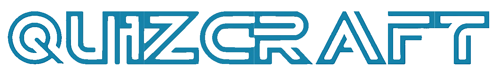

# QuizCraft Backend

**Welcome to the QuizCraft Backend repository!**



**QuizCraft Backend is a powerful, automated quiz generation system that leverages machine learning part to create
engaging quizzes from source material. With its seamless management of the entire quiz process, from question generation
to user quiz-taking and result storage, our backend ensures a smooth and interactive quiz experience.**


## Table of Contents

* [Application Components](#components)
    * [Django](#django)
    * [Celery](#celery)
    * [RabbitMQ](#rabbitmq)
    * [Redis](#redis)
* [Usage](#usage)
    * [Authentication](#authentication)
    * [Endpoints](#endpoints)
        * [Quiz endpoints](#quiz-endpoints)
        * [Authentication endpoints](#authentication-endpoints)
* [Installation](#installation)
* [Configuration](#configuration)

## <a name="components"></a>Components

### <a name="django"></a>Django

**Description:** Django is a powerful backend framework that serves as the core logic for the entire application. It
acts as a driver for all the components, orchestrating their interactions and functionalities.

**Components:**

- **QuizGeneratorModel:** This component is responsible for generating quizzes.
- **Redis:** Used for data caching, providing a faster access to frequently accessed data.
- **PostgreSQL:** Used for data storage, ensuring the persistence and reliability of application data.
- **RabbitMQ:** Serves as a message broker, enabling the generation of quizzes in parallel with the Django server.
- **Celery:** Acts as a mediator between Django, RabbitMQ, and Redis. It facilitates the processing of asynchronous
  tasks, making the application more responsive and efficient.

### <a name="celery"></a>Celery

**Description:** Celery is a powerful task queue system that works as a mediator to handle asynchronous tasks within the
application. It integrates with RabbitMQ and Redis to create a smooth workflow for processing tasks.

**Key Features:**

- Asynchronous Task Processing: Celery allows tasks to be executed asynchronously, ensuring the server can handle
  multiple requests without delays.
- Integration with RabbitMQ: Celery uses RabbitMQ as its message broker, providing a reliable and scalable communication
  channel.
- Integration with Redis: Celery utilizes Redis to handle task results and store temporary data, enhancing performance
  and efficiency.

### <a name="rabbitmq"></a>RabbitMQ

**Description:** RabbitMQ is a message broker that plays a crucial role in managing asynchronous tasks within the
application. It facilitates the seamless communication between different components, allowing the server to serve user
requests continuously without interruptions.

**Key Features:**

- Automatic Queue Creation: RabbitMQ's integration with Celery enables the automatic creation and management of queues
  without requiring any developer intervention.
- Reliable Asynchronous Processing: By offloading time-consuming tasks to background processes, RabbitMQ ensures a
  smoother user experience and better performance.

### <a name="redis"></a>Redis

**Description:** Redis is a fast and efficient cache database that stores the results of message broker tasks in
volatile memory. In addition to its role as a cache, Redis is also used in the project for translating quiz identifiers
into task identifiers, providing key-value translation for efficient tracking of quiz generation progress.

**Key Uses:**

- Caching: Redis caches frequently accessed data, reducing the need for repeated computations and enhancing the
  application's responsiveness.
- Translation of Quiz Identifiers: Redis facilitates the mapping of quiz identifiers to task identifiers, enabling the
  tracking of task progress during quiz generation.

## <a name="installation"></a>Installation

1. **Clone project with all submodules**

    ```bash
    git clone --recurse-submodules https://github.com/QuizCraftCorporation/DjangoQuizCraftBackend.git
    ```

2. **Install Docker and Docker Compose**:
    - Make sure you have Docker and Docker Compose installed on your machine. Refer to the official Docker documentation
      for installation instructions specific to your operating system:
        - [Install Docker](https://docs.docker.com/get-docker/)
        - [Install Docker Compose](https://docs.docker.com/compose/install/)

3. **Prepare Environmental Files**:
    - Navigate to the `config` directory and find the `.env*-example` files.
    - Duplicate each `.env*-example` file and rename the copies as `.env.dev*` and `.env.prod*` for development and
      production environments, respectively.

4. **Python Version**:
    - Ensure you have Python version 3.10 or higher installed on your system.

5. **RabbitMQ Secret Password**:
    - Ensure that the RabbitMQ secret password is provided in .env.*.rabbitmq
6. **Generate Secrets**:
    - Run the `secrets_gen.sh` script located in the `scripts` directory to generate secrets for PostgreSQL and Redis:
      ```bash
      bash scripts/secrets_gen.sh
      ```

7. **Generate Django Secret Key**:
    - After running the `key_gen.sh` script, a new Django secret key will be generated. For security purposes,
      replace the existing secret key in the `.env.*.django` file with the newly generated one.

8. **Configure DJANGO_ALLOWED_HOSTS**:
    - Properly configure the `DJANGO_ALLOWED_HOSTS` environment variable in the `.env.dev` or `.env.prod` file,
      depending on the build version (development or production), to include the hostnames that will be used in this
      environment.

9. **Configure Django Host and Port**:
    - Set the appropriate host and port for the main Django project in the `.env.dev` or `.env.prod` file, depending on
      the version of the build (development or production).
10. **Run Docker Compose**:
     - Open a terminal/command prompt in the project root directory.
     - To start and build the development version, run the following command:
       ```bash
       docker-compose --env-file ./config/.env.dev up -d --build
       ```
     - To start and build the production version, run the following command:
       ```bash
       docker-compose -f docker-compose.prod.yml --env-file ./config/.env.prod up -d
       ```
     - The `-d` flag runs the containers in the background (detached mode).

11. **Access QuizCraft Backend**:
- Once the containers are up and running, by default you can access QuizCraft Backend by navigating to `http://localhost:8000` in
  your web browser.

11. **Stopping the Containers**:
    - To stop and remove the containers, run the following command:
      ```bash
      docker-compose -f docker-compose.yml down
      # OR
      docker-compose -f docker-compose.prod.yml down

## <a name="configurations"></a>Configuration

The following environmental files need to be set up for proper configuration:

- **.env.dev** with some postfix: Used for the development environment.
- **.env.prod** with some postfix: Used for the production environment.

Ensure all the necessary environment variables, including database connection details, Django settings, and any other
configurations specific to your project, are properly set in these files.

With the above installation and configuration steps completed, you are all set to run the QuizCraft Backend system and
enjoy the automated quiz generation experience!

## <a name="usage"></a>Usage

QuizCraft Backend serves as a REST API service, providing a range of features that can be accessed through RESTful
requests. With our API, you can seamlessly generate quizzes, manage user responses, and retrieve quiz results.

To get started, refer to our comprehensive API documentation on Postman. Click on the Postman logo below to access the
documentation:

[](https://app.getpostman.com/join-team?invite_code=ee9ea33d88603fe51e6e3320407c78e2&target_code=c481c4d148291fdf8c047dc99899bc38)

The Postman collection includes details about each API endpoint, required parameters, authentication methods, response
formats, and example requests. You can experiment with the API right from the documentation, allowing for easy
integration with your applications.

### <a name="authentication"></a>Authentication

Before making requests to the QuizCraft Backend API, ensure that you include the required authentication JWT tokens with
Bearer prefix.

### <a name="endpoints"></a>Endpoints

Below are some essential API endpoints available for use:

#### <a name="quiz-endpoints"></a>Quiz endpoints

- `GET /api/quiz`: Retrieve a list of available quizzes.
- `GET /api/quiz/{quiz_id}`: Fetch details of a specific quiz.
- `POST /api/quiz`: Create a new quiz based on the provided source material.
- `POST /api/quiz/{quiz_id}/attempt`: Submit user attempt for a quiz.
- `GET /api/quiz/me`: Get list of your quizzes.
- `GET /api/quiz/search`: Get quizzes sorted by similarity to your request data in decreasing order.

#### <a name="authentication-endpoints"></a>Authentication endpoints

- `POST /api/auth/login`: Get a pair of access and refresh tokens using login and password.
- `POST /api/auth/register`: Create a new instance of user in database with given login, password and personal data.

Refer to the Postman documentation for a complete list of all available endpoints, along with their descriptions and
sample requests.
